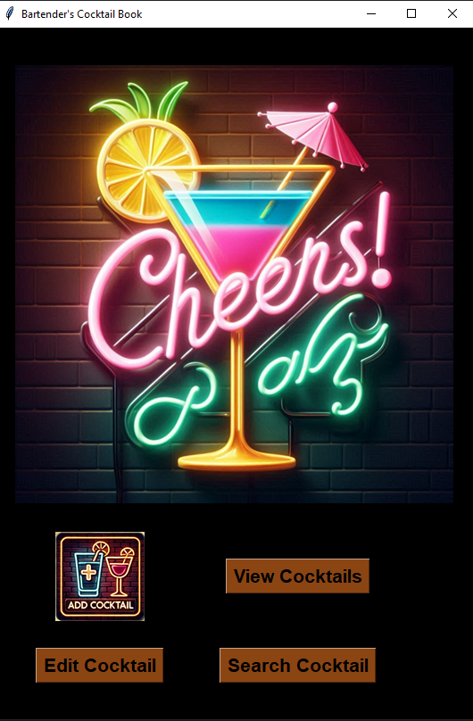

# TODO 1 abv auto calculate
# TODO 2 different buttons
# TODO 3 maybe separate gui from real functions
# TODO 4 font color cant be white
# TODO 5 142 line error
# TODO 6 to make my closet with my alchol and then new attribute to each cocktail, which alcogol is needed "vodka,gin"
# TODO 7 function that look what you have and suggest by that cocktials
# https://chatgpt.com/share/67393297-258c-8008-affd-6ba5924a9672
#TODO 9 fix that abv
what about a look at what cocktails I can make in general?

https://github.com/rasmusab/iba-cocktails/blob/main/wikipedia/iba-cocktails-wiki.json
https://www.diffordsguide.com/g/1127/worlds-top-100-cocktails/1-20

